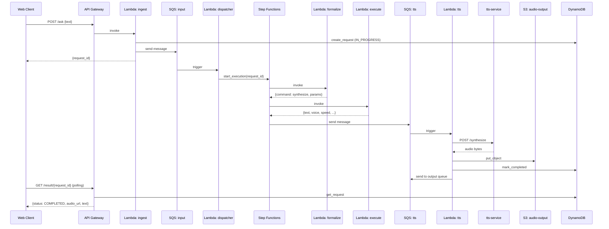
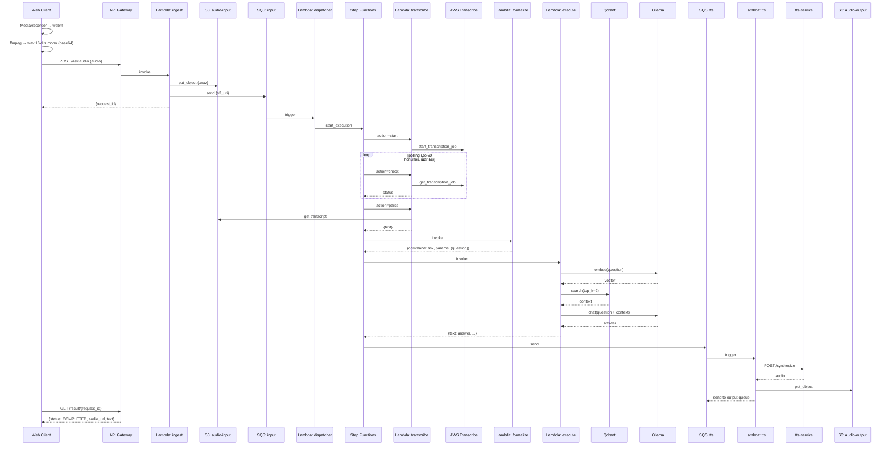

# Система автоматизированного синтеза и анализа речи

## Общее описание

Система синтеза и распознавания речи на основе serverless-модели. Человек вводит вводит запрос на естественном языке в текстовом или голосовом формате. Задача системы понять, что хочет узнать человек.

Каких видов запросы могут быть:

- Озвучивание текстового или голосового запроса. Если человек опирается на слова, по смыслу схожие на `озвучь`, `прочитай`, `скажи` и прочие, то запрос формализуется с действием `synthesize`, тело запроса просто озвучивается. 
- Анализ текстового или голосового запроса. Если человек задает вопрос, например, связанный с жизнью Пушкина, то система ответит на вопрос, заданный в запросе, действие запроса будет формализовано как `ask`.
- Если по некой причине запрос был неясен, либо произошла ошибка, то действие помечается типом `synthesize`.

## Стек

| Приминение | Технологии |
|---|---|
| **Frontend / BFF** | FastAPI, Jinja2, httpx |
| **Синтез речи** | Piper TTS, ffmpeg |
| **Распознавание речи** | AWS Transcribe (LocalStack) |
| **LLM** | Ollama (`qwen2.5:3b` — формализация, `qwen2.5:3b` — ответы, `nomic-embed-text` — эмбеддинги) |
| **Векторный поиск** | Qdrant |
| **Кэш / Rate limit** | Redis |
| **Оркестрация** | AWS Step Functions (LocalStack) |
| **Очереди** | AWS SQS + DLQ (LocalStack) |
| **Хранилище** | AWS S3 (LocalStack) |
| **Состояние запросов** | AWS DynamoDB (LocalStack), TTL 24ч |
| **Секреты** | AWS Secrets Manager, SSM Parameter Store (LocalStack) |
| **Инфраструктура** | Terraform (провайдер AWS → LocalStack) |
| **Упаковка** | Docker Compose, `build_lambdas.sh` |
| **Тесты** | pytest, pytest-asyncio |

## Архитектура

### Сценарий 1: текстовый запрос по смыслу схож с целью «озвучь»



### Сценарий 2: аудио-запрос (распознавание и ответ)



## Запуск

Ключевые команды:

**1. Собрать Lambda-артефакты** (zipы в `build/`):

```bash
./build_lambdas.sh 
# можно указать, например, ./build_lambdas.sh execute, и будет собрана только execute лямбда
```

**2. Поднять инфраструктуру в LocalStack** (создаёт S3, SQS, DynamoDB, IAM, Lambda, Step Functions, API Gateway, Secrets Manager, SSM, в рамках данного окружения выполнить после Compose):

```bash
cd terraform/environments/dev && terraform init && terraform apply
```

**3. Запустить сервисы** (LocalStack, Ollama, Qdrant, Redis, tts-service, web-client):

```bash
docker compose up -d
```

После этого:
- Web-клиент — `http://localhost:8092`
- TTS-сервис — `http://localhost:8001`
- LocalStack — `http://localhost:4566`